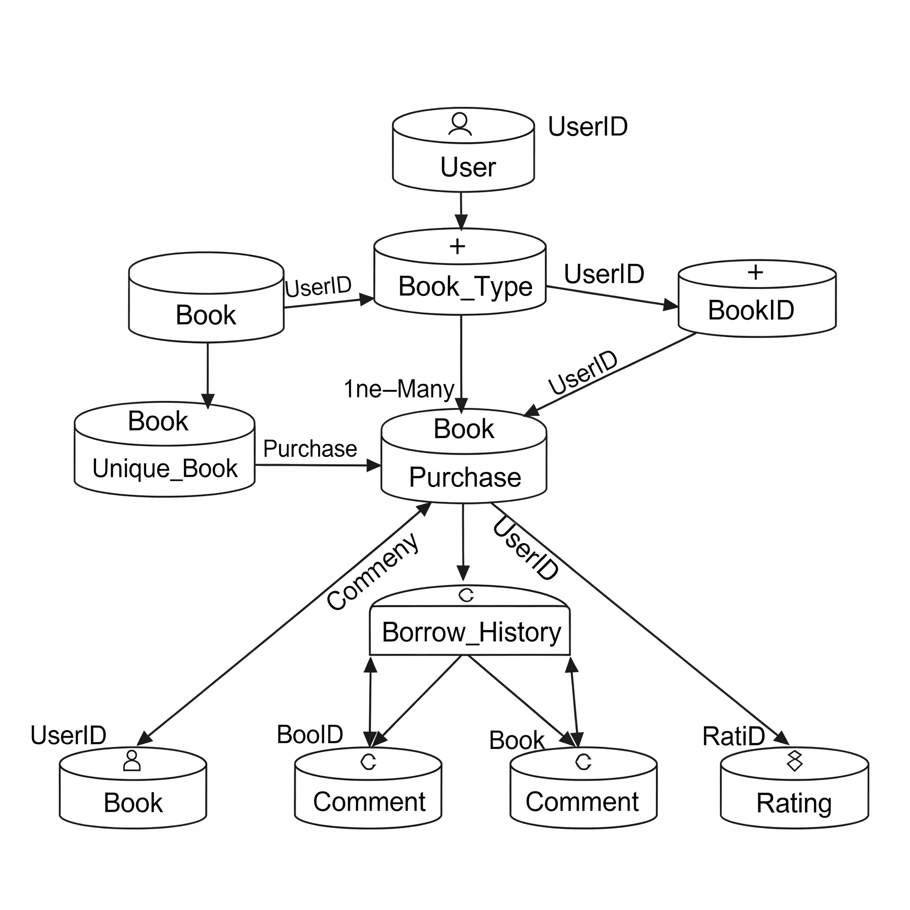

# Library Management System

A comprehensive library management system built with Python and the Flask framework. This application provides a web-based interface for managing books, users, and borrowing/purchasing transactions, with distinct roles for regular users, librarians, and administrators.

## Features

The application supports three user roles, each with a specific set of permissions and features.

### 👤 User Features

  * **Authentication:** Secure user registration and login.
  * **Book Catalog:** View and search for available books.
  * **Book Interaction:**
      * Borrow available books for a set period.
      * Purchase books using account credits.
      * Return borrowed books.
      * Leave comments on book pages.
  * **Personal Dashboard:** View currently borrowed books and purchase history in a "My Books" section.

### 📚 Librarian Features

  * **Book Management (CRUD):**
      * Add new books to the catalog with details like title, author, ISBN, price, and cover image.
      * Edit existing book information.
      * Add or remove individual copies of a book.
      * Delete books entirely from the catalog.
  * **User Management:**
      * View all registered users.
      * Add credits to user accounts.
      * View a specific user's purchase and borrowing history.
  * **Reporting:** Download a user's purchase or borrowing history as a CSV file.
  * **Inventory Overview:** View all books and their individual copies' statuses (available, borrowed).

### ⚙️ Admin Features

  * **Full User Management:**
      * View all users, including librarians.
      * Add new librarian accounts.
      * Delete any user or librarian account.
  * **Content Moderation:** Delete user comments from any book page.
  * **System Oversight:** Access to view all books and users in the system.

-----

## Technology Stack

  * **Backend:** Python, Flask
  * **Database:** SQLAlchemy ORM with a SQLite backend
  * **Authentication:** Flask-Login
  * **Frontend:** HTML, CSS, JavaScript (with Jinja2 for templating)
  * **Configuration:** python-dotenv

-----

## Project Setup

Follow these steps to get the project running on your local machine.

### 1\. Prerequisites

  * Git
  * Python 3.8+

### 2\. Clone the Repository

Clone the project to your local machine.

```bash
git clone https://github.com/Parthpawer/Library-Management-System.git
cd library_project
```

### 3\. Create a Virtual Environment

It's highly recommended to use a virtual environment to manage project dependencies.

```bash
# Create the virtual environment (e.g., named 'temp')
python -m venv temp

# Activate it
# On Windows:
temp\Scripts\activate
# On macOS/Linux:
source temp/bin/activate
```

### 4\. Install Dependencies

Install all the required packages from the `requirements.txt` file.

```bash
pip install -r requirements.txt
```

### 5\. Set Up Environment Variables

This project uses a `.env` file to manage sensitive information and configuration.

**a.** Create a file named `.env` in the root directory.

**b.** Copy the following content into it and fill in your desired values.

```env
# Flask and Database Configuration
SECRET_KEY="a_super_secret_key_that_is_long_and_random"
DATABASE_URL="sqlite:///library.db"

# Initial Admin User
ADMIN_USERNAME="admin"
ADMIN_EMAIL="admin@example.com"
ADMIN_PASSWORD="admin_password_123"

# Initial Librarian User
LIBRARIAN_USERNAME="librarian1"
LIBRARIAN_EMAIL="librarian@example.com"
LIBRARIAN_PASSWORD="librarian_password_123"

# Initial Book Categories (comma-separated)
INITIAL_BOOK_TYPES="Learning,Movie,Magazine,Novel,Comic"
```

### 6\. Create Seed Data File

The initial book data is loaded from a JSON file. Create a file named `seed_books.json` in the root directory and add your book data to it.

```json
[
  {
    "title": "The Great Gatsby",
    "author": "F. Scott Fitzgerald",
    "isbn": "9780743273565",
    "publisher": "Scribner",
    "description": "A novel set in the Jazz Age on Long Island.",
    "price": 15.99,
    "cost_per_day": 0.5,
    "genre_id": 1,
    "book_type_id": 4,
    "image": null
  },
  {
    "title": "To Kill a Mockingbird",
    "author": "Harper Lee",
    "isbn": "9780061120084",
    "publisher": "J.B. Lippincott & Co.",
    "description": "A novel about racial injustice in the Deep South.",
    "price": 12.99,
    "cost_per_day": 0.4,
    "genre_id": 1,
    "book_type_id": 4,
    "image": "mockingbird.jpg"
  }
]
```

### 7\. Run the Application

Now, you can run the application. The code will automatically create and seed the database file (`instance/library.db`) on the first run.

```bash
python run.py
```

The application will be available at **[http://127.0.0.1:5000](http://127.0.0.1:5000)**.

-----

## Database Schema

The application uses several models to represent its data structure.

  * **`User`**: Stores user information, including credentials and role (`user`, `librarian`, `admin`).

      * *Key Fields:* `id`, `username`, `email`, `password`, `role`, `credits`.
      * *Relationships:* Has many `Comments`, `Ratings`, `Purchases`, and `BorrowHistory` records.

  * **`Book`**: The master record for a book title.

      * *Key Fields:* `id`, `title`, `author`, `isbn`, `description`, `price`, `cost_per_day`, `image`.
      * *Relationships:* Belongs to one `BookType`. Has many `UniqueBook` copies.

  * **`UniqueBook`**: Represents a single physical copy of a `Book`.

      * *Key Fields:* `id`, `status` ('available' or 'borrowed'), `borrower_id`.
      * *Relationships:* Belongs to one `Book`. Can be borrowed by one `User`. Has many `BorrowHistory` records.

  * **`BookType`**: Categories for books (e.g., 'Novel', 'Magazine').

      * *Key Fields:* `id`, `name`.

  * **`Purchase`**: A log of a user purchasing a book.

      * *Key Fields:* `id`, `user_id`, `book_title`, `price_paid`, `bought_on`.

  * **`BorrowHistory`**: A log of every time a `UniqueBook` is borrowed and returned.

      * *Key Fields:* `id`, `user_id`, `copy_id`, `borrowed_on`, `returned_on`.

  * **`Comment`**: Stores user comments on a `Book`.

      * *Key Fields:* `id`, `content`, `user_id`, `book_id`.

  * **`Rating`**: Stores user ratings for a `Book` (if implemented).

      * *Key Fields:* `id`, `rating`, `user_id`, `book_id`.


